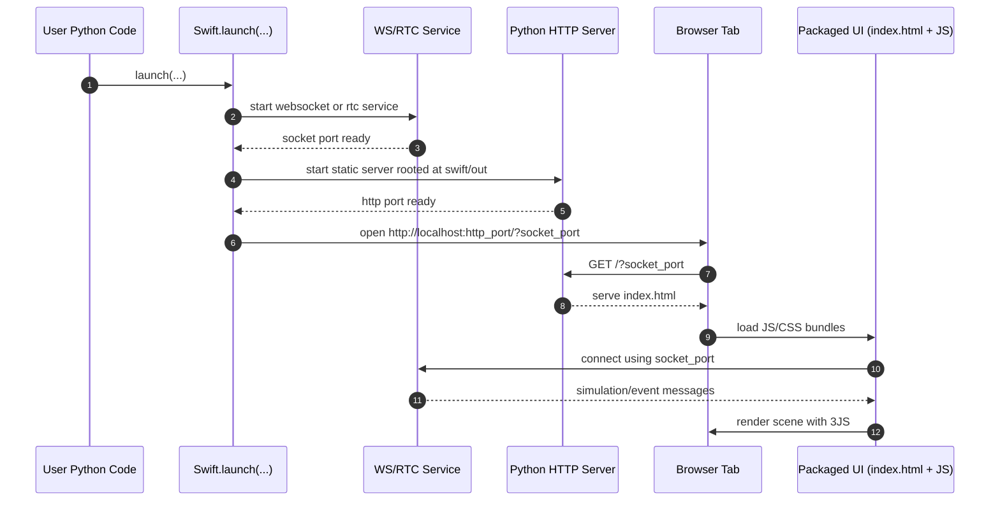
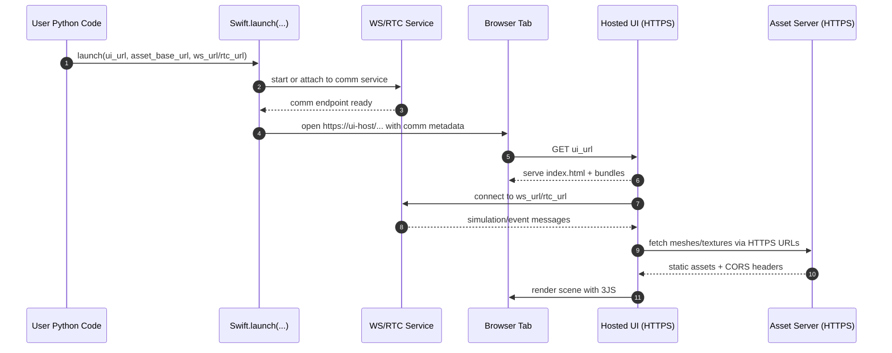

# Future Plan: Remove Local Microserver For Asset Retrieval

**Status (2026-07-26):** written earlier, before the frontend rebuild —
file references below are stale (`swift/public/js/lib.js` →
`shapes.js`/`main.js`; `swift/public/js/index.js` → `main.js`;
`next-swift/server.ts` no longer exists, `next-swift/` and `swift/out/`
were removed entirely; `SwiftRoute.py` still has the `/retrieve/`
passthrough this doc proposes removing). The architectural direction
(hosted UI/assets over HTTPS instead of a local filesystem-passthrough
microserver) still applies and hasn't been implemented. See also
`tech-debt.md`'s "JupyterLite / Pyodide transport" entry — the
`WebSocketTransport` seam built during the rebuild is a narrower,
comms-only piece of the same underlying problem this document plans
for more broadly (assets, not just messages).

## Goal

Replace local `/retrieve/...` file access with standard HTTPS asset delivery, while preserving:

- normal desktop Python usage;
- notebook embedding (`browser="notebook"`);
- optional RTC/WebSocket comms behavior;
- practical support for Jupyter and JupyterLite display workflows.

## Current State (What Exists Today)

## Current Startup Sequence And Initial Page Role

The page that opens in a new browser tab during `Swift.launch(...)` is currently a locally served packaged frontend page.

Startup sequence today:

1. Swift creates communication services:
   - WebSocket server by default; or
   - RTC flow when configured.
2. Swift starts a local Python HTTP server that serves static files from the packaged frontend build output (`swift/out`).
3. Swift opens a browser tab to the local server URL, including the socket port in the query string.
4. The HTTP handler maps the startup URL to `index.html`.
5. The frontend JS (including 3JS) boots in the browser, connects back to the socket service, and renders scene updates.

### Startup Sequence Diagram

### Target Sequence Diagram (No Local Microserver)

Role of this initial page:

- It is the runtime UI shell for Swift, not just a blank landing page.
- It loads all frontend bundles and styles used by the simulator.
- It establishes the browser-side connection used for receiving simulation state and sending UI events.
- It drives 3JS rendering and user interaction controls.

What it is and is not:

- It is currently served by the local Python microserver at runtime.
- It is not generated dynamically from Python templates each run.
- It is not, by default, fetched from an external website.

## Alternative Ways To Provide The Initial Page

The same UI can be delivered in several ways:

1. Packaged static build (current behavior)
   - Build frontend once and ship it inside the Python package.
   - Python serves the files locally.

2. Hosted static site (recommended future path)
   - Publish the built UI to a normal HTTPS web server.
   - Swift opens that hosted URL instead of local `index.html`.
   - Requires explicit configuration for socket endpoint and asset base URL.

3. Dev server workflow
   - Use the Next/Node development server during frontend development.
   - Useful for rapid UI iteration, not ideal as the production runtime default.

4. Custom forked UI
   - Maintain a custom frontend page/app with the same protocol contract.
   - Swift points to that page via a configurable `ui_url`-style setting.

For maintainability, option 2 should become a first-class supported mode, while option 1 remains available as a compatibility/offline mode during migration.

### Python side

- `start_servers(...)` spins up:
  - a WebSocket or RTC signaling service; and
  - a local HTTP server serving the UI from `swift/out`.
- notebook mode embeds a local URL in an `IFrame`.
- the HTTP handler has special handling for `/retrieve/...` and opens a real path from the local filesystem.

Relevant implementation: `swift/SwiftRoute.py`.

### JS/3JS side

- scene object loading is done via loaders (`ColladaLoader`, `STLLoader`, `OBJLoader`, etc.) in `swift/public/js/lib.js`.
- loaders consume `ob.filename` values as URLs.

### Next dev microserver

- the Next dev server also has custom `/retrieve/...` passthrough behavior.

Relevant implementation: `next-swift/server.ts`.

## Architecture Direction

Adopt an explicit Asset URL strategy:

1. viewer UI served from a web origin (or local dev during development only);
2. mesh/texture assets fetched by normal HTTPS URLs;
3. no direct filesystem reads through `/retrieve` routes;
4. Python emits resolvable URLs (or URL templates), not local file paths.

## Detailed Change Plan

## Phase 0: Discovery And Compatibility Matrix

1. Inventory every place where `ob.filename` is produced (robot and shape dictionary serialization paths).
2. Classify asset references:
   - absolute local path;
   - relative package path;
   - already-remote URL.
3. Build a compatibility table for:
   - desktop script + browser tab;
   - Jupyter notebook (local kernel);
   - JupyterHub/remote kernel;
   - JupyterLite (Pyodide).

Deliverable: a short internal doc listing all producers and expected URL forms.

## Phase 1: Introduce URL Resolution Layer (Python)

Create a single policy point for asset URL generation. Suggested API shape:

- `asset_mode`: `"local" | "remote" | "auto"`
- `asset_base_url`: optional, e.g. `https://assets.example.com/swift-assets/`
- `asset_url_resolver(path) -> str`: optional callback override.

Behavior:

- if input is already `http://` or `https://`, pass through;
- if `asset_mode=remote`, convert local/relative paths to HTTPS URLs under `asset_base_url`;
- if `asset_mode=local`, keep legacy behavior initially for migration window;
- if `asset_mode=auto`, select remote in notebook/cloud contexts when configured.

Important: URL-encode safely and normalize path separators cross-platform.

## Phase 2: Frontend URL Consumption Hardening

1. Ensure all loaders in `swift/public/js/lib.js` accept remote URLs without assumptions.
2. Remove any platform hacks that mutate URL strings in a way that breaks HTTPS URLs.
3. Add explicit error surfacing in loader callbacks:
   - include URL attempted;
   - include HTTP status where available.

Optional:

- add retry fallback (primary CDN URL then secondary URL).

## Phase 3: Remove `/retrieve` From Servers

### Python HTTP server

- delete `/retrieve` code path from `SwiftRoute.py`.
- keep static UI serving for local-only mode if still needed.

### Next dev server

- remove custom `/retrieve` branch in `next-swift/server.ts`.
- let Next handle all routes normally.

## Phase 4: Server-Side Asset Hosting

Design static hosting layout:

- stable URL prefix, e.g. `/swift-assets/`;
- deterministic paths for meshes/textures;
- immutable cache policy for versioned assets;
- content-type correctness (`.stl`, `.dae`, `.obj`, `.mtl`, images).

Recommended path scheme:

- include package version or hash in URL path to avoid stale cache collisions.

## Phase 5: Jupyter And JupyterLite Display Strategy

### Jupyter (classic/lab, Python kernel)

Display is straightforward if:

- iframe source is reachable (HTTPS preferred in hosted notebook setups);
- WS/RTC endpoint is reachable from browser context;
- mesh assets are reachable via HTTPS with valid CORS.

Recommended notebook mode additions:

- explicit `ui_url` option (hosted UI origin);
- explicit `ws_url` / `rtc_url` option;
- explicit `asset_base_url` option.

### JupyterLite

Key constraint: no local CPython server process is available in-browser, so current threaded Python microserver model does not apply.

Practical options:

1. Display-only playback mode:
   - precompute trajectory/events JSON;
   - load viewer and animate from static data;
   - no live Python control loop.
2. Full interactive mode via external backend:
   - browser viewer in JupyterLite communicates with a remote WS/RTC service.

For initial maintainability, implement option (1) first.

## CORS Implications By Hosting Target

## Target A: GitHub-hosted

Possible interpretations: GitHub Pages, raw.githubusercontent.com, or release assets.

Important constraints:

- GitHub Pages does not provide robust per-path custom header control in the way a managed web server does.
- If you need explicit `Access-Control-Allow-Origin` tuning, GitHub-only hosting can be limiting.

Recommendations:

1. Prefer same-origin where possible:
   - host viewer and assets under the same GitHub Pages origin.
2. If cross-origin is unavoidable:
   - test actual response headers for asset endpoints used by loader XHR/fetch;
   - if headers are insufficient, front with a CDN/proxy where headers are configurable.

Risk:

- CORS failures will appear as loader/network errors in browser console even if URL is otherwise valid.

## Target B: SiteGround-hosted personal site

Likely Apache or Nginx managed hosting; header control is typically available via server config or `.htaccess`.

Suggested CORS policy (static assets):

- `Access-Control-Allow-Origin`: allow notebook/viewer origins explicitly;
- `Access-Control-Allow-Methods`: `GET, HEAD, OPTIONS`;
- `Access-Control-Allow-Headers`: `Origin, Accept, Content-Type, Range`;
- `Access-Control-Expose-Headers`: include `Content-Length`, `Content-Range` when needed.

Use explicit allow-list in production rather than wildcard when credentials or stricter security posture is required.

If WebSocket endpoint is also hosted there:

- configure TLS (`wss://`);
- configure reverse proxy upgrade headers;
- validate origin checks at WS server layer.

## Security Requirements

1. Remove filesystem passthrough serving.
2. Enforce HTTPS URLs for remote mode.
3. Optional allow-list for asset host domains.
4. Clear logs for denied/invalid asset URLs.

## Testing Plan

## Unit tests

1. URL resolver:
   - local path to expected remote URL;
   - pre-existing HTTPS URL passthrough;
   - Windows path normalization;
   - URL escaping correctness.

## Integration tests

1. Run viewer with remote asset URLs and verify mesh loads.
2. Verify no `/retrieve` path is required.
3. Jupyter embed smoke test:
   - iframe loads;
   - one robot and one shape appear;
   - stepping updates pose.
4. Negative test:
   - disallowed origin or missing CORS header produces expected surfaced error.

## Manual matrix

1. Local desktop Python + local browser.
2. JupyterLab local.
3. JupyterHub remote.
4. JupyterLite static demo playback.

## Rollout Strategy

1. Add URL resolver behind opt-in flags.
2. Ship with dual mode (`local` + `remote`) for one release cycle.
3. Gather feedback and fix notebook/cloud edge cases.
4. Deprecate `/retrieve` with warning.
5. Remove `/retrieve` routes and local filesystem access in next minor/major release.

## Suggested Maintainer Tasks (Shortlist)

1. Implement resolver API and tests first.
2. Add explicit configuration knobs in `Swift.launch(...)` and docs.
3. Stand up a reference asset bucket/path on SiteGround.
4. Validate CORS with a notebook-origin test page.
5. Add a JupyterLite playback example notebook.

## Open Questions To Resolve Early

1. Where should canonical asset hosting live long-term (GitHub+CDN vs SiteGround)?
2. Do we require fully offline local mode forever, or can it become optional?
3. Should remote asset URLs be generated by Swift only, or pre-baked by upstream model packages?
4. Is live interactive JupyterLite a requirement, or is display-only acceptable for first release?

## Definition Of Done

1. No runtime reliance on `/retrieve` in production path.
2. Remote HTTPS assets load in browser, notebook, and hosted notebook contexts.
3. CORS behavior is documented and tested for both chosen host targets.
4. Jupyter display works with hosted UI/assets.
5. JupyterLite has at least one supported display mode with documented limitations.

## Actionable Issue Checklist

Use this as a maintainers' issue board seed. Each item should become an individual issue.

- [ ] Add asset URL configuration fields to Swift API (`asset_mode`, `asset_base_url`, `asset_url_resolver`).
- [ ] Implement a central Python asset URL resolver utility with path normalization and URL escaping.
- [ ] Wire resolver into all object serialization paths that populate `ob.filename`.
- [ ] Add unit tests for resolver behavior (local path, remote passthrough, Windows paths, escaping).
- [ ] Harden JS loaders to treat `ob.filename` as URL and report loader URL failures clearly.
- [ ] Remove JS assumptions/path mutations that can corrupt HTTPS URLs.
- [ ] Remove `/retrieve` handling from Python HTTP handler.
- [ ] Remove `/retrieve` handling from Next dev server.
- [ ] Add notebook launch options for hosted UI and comms (`ui_url`, `ws_url`/`rtc_url`).
- [ ] Add Jupyter smoke test for hosted UI + hosted assets.
- [ ] Define and document GitHub-hosted deployment recipe (same-origin preferred, fallback proxy/CDN if needed).
- [ ] Define and document SiteGround-hosted deployment recipe with explicit CORS header config.
- [ ] Add integration tests proving operation without `/retrieve`.
- [ ] Add JupyterLite display-only playback example and documentation.
- [ ] Add migration/deprecation note in docs for `/retrieve` removal and local filesystem serving behavior.

## File-Level Change Map

Likely files to touch, with expected scope.

### Python runtime and server

- `swift/Swift.py`
   - Add public launch/config API for asset hosting mode and URL options.
   - Pass resolved options into startup/server/frontend message flow.

- `swift/SwiftRoute.py`
   - Remove `/retrieve` file passthrough branch.
   - Keep static UI serving only (or make optional if moving to fully hosted UI).
   - Support notebook mode with externally hosted `ui_url` and optional explicit WS/RTC URLs.

- `swift/__init__.py`
   - Export any new helper/config types if part of public API.

- `tests/` (new tests + updates)
   - Add resolver unit tests.
   - Add integration tests for no-`/retrieve` operation.
   - Add notebook-oriented smoke tests where feasible.

### Frontend runtime

- `swift/public/js/lib.js`
   - Ensure all loaders use provided URL as-is.
   - Improve error callbacks/logging for failed URL fetches.
   - Remove legacy path tweaks that are local-path specific.

- `swift/public/js/index.js`
   - Optional: support externally configured WS endpoint if needed for hosted notebook/JupyterLite scenarios.

### Dev frontend server

- `next-swift/server.ts`
   - Remove custom `/retrieve` route behavior.
   - Keep pure Next/Express request handling for UI development.

### Documentation and examples

- `README.md`
   - Add hosted-asset deployment docs.
   - Document CORS expectations and recommended origin policies.
   - Document notebook and JupyterLite supported modes.

- `examples/` (new or updated)
   - Add a hosted-assets example for regular Python/Jupyter.
   - Add a JupyterLite-compatible display-only playback example.

## Suggested Milestone Grouping

1. Milestone 1: URL resolver and API
    - Resolver utility, Swift API knobs, unit tests.
2. Milestone 2: Frontend hardening
    - Loader/path fixes, error surfacing, no regression in local/dev.
3. Milestone 3: Server route removal
    - Delete `/retrieve` in Python and Next dev server, add integration tests.
4. Milestone 4: Hosted deployments + docs
    - GitHub/SiteGround CORS recipes, notebook hosted mode docs.
5. Milestone 5: JupyterLite support
    - Display-only playback path, sample notebook, documented limitations.
