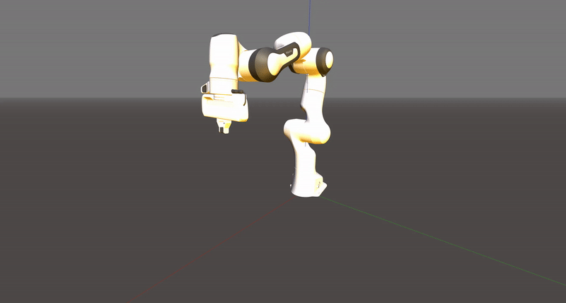

# Swift

[](https://badge.fury.io/py/swift-sim)
[](https://img.shields.io/pypi/pyversions/swift-sim)
[](https://opensource.org/licenses/MIT)
[](https://qcr.github.io)

Swift is a light-weight browser-based simulator built on top of the [Robotics Toolbox for Python](https://github.com/petercorke/robotics-toolbox-python). This simulator provides robotics-specific functionality for rapid prototyping of algorithms, research, and education. Built using Python and Javascript, Swift is cross-platform (Linux, MacOS, and Windows) while also leveraging the ubiquity and support of these languages.

Through the [Robotics Toolbox for Python](https://github.com/petercorke/robotics-toolbox-python), Swift can visualise over 30 supplied robot models: well-known contemporary robots from Franka-Emika, Kinova, Universal Robotics, Rethink as well as classical robots such as the Puma 560 and the Stanford arm. Swift is under development and will support mobile robots in the future.

Swift provides:

  * visualisation of mesh objects (Collada and STL files) and primitive shapes;
  * robot visualisation and simulation;
  * recording and saving a video of the simulation;
  * source code which can be read for learning and teaching;

## Installing
### Using pip

Swift is designed to be controlled through the [Robotics Toolbox for Python](https://github.com/petercorke/robotics-toolbox-python). By installing the toolbox through PyPI, swift is installed as a dependency

```shell script
pip3 install roboticstoolbox-python
```

Otherwise, Swift can be install by

```shell script
pip3 install swift-sim
```

### From GitHub

To install the latest version from GitHub

```shell script
git clone https://github.com/jhavl/swift.git
cd swift
pip3 install -e .
```

## Code Examples

### Robot Plot
We will load a model of the Franka-Emika Panda robot and plot it. We set the joint angles of the robot into the ready joint configuration qr.

```python
import roboticstoolbox as rp

panda = rp.models.Panda()
panda.plot(q=panda.qr)
```
<p align="center">
 
</p>

### Resolved-Rate Motion Control
We will load a model of the Franka-Emika Panda robot and make it travel towards a goal pose defined by the variable Tep.

```python
import roboticstoolbox as rtb
import spatialmath as sm
import numpy as np

# Make and instance of the Swift simulator and open it
env = rtb.backends.Swift()
env.launch()

# Make a panda model and set its joint angles to the ready joint configuration
panda = rtb.models.Panda()
panda.q = panda.qr

# Set a desired and effector pose an an offset from the current end-effector pose
Tep = panda.fkine() * sm.SE3.Tx(0.2) * sm.SE3.Ty(0.2) * sm.SE3.Tz(0.45)

# Add the robot to the simulator
env.add(panda)

# Simulate the robot while it has not arrived at the goal
arrived = False
while not arrived:

    # Work out the required end-effector velocity to go towards the goal
    v, arrived = rtb.p_servo(panda.fkine(), Tep, 1)
    
    # Set the Panda's joint velocities
    panda.qd = np.linalg.pinv(panda.jacobe()) @ v
    
    # Step the simulator by 50 milliseconds
    env.step(0.05)
```
<p align="center">
 
</p>
