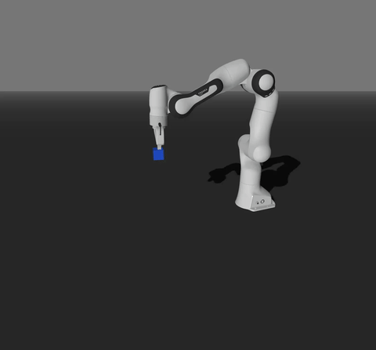

# Swift

[](https://badge.fury.io/py/swift-sim)
[](https://img.shields.io/pypi/pyversions/swift-sim)
[](https://opensource.org/licenses/MIT)

[](https://github.com/petercorke/robotics-toolbox-python)
[](https://qcr.github.io)

[GitHub repository](https://github.com/jhavl/swift) &nbsp;|&nbsp; [Documentation](https://jhavl.github.io/swift/)

Swift is a light-weight browser-based animation visualizer which provides:

  * visualisation of mesh objects (Collada, STL, OBJ, glTF/GLB, PLY, VRML/WRL, and PCD files) and primitive shapes;
  * visualisation of multi-link robots created with the [Robotics Toolbox for Python](https://github.com/petercorke/robotics-toolbox-python);
  * interactive UI controls (sliders, buttons, and more) for driving a scene from the browser;
  * recording and saving a video of the simulation;
  * source code which can be read for learning and teaching;

Built using Python and Javascript, Swift is cross-platform (Linux, MacOS, and Windows) while also leveraging the ubiquity and support of these languages.

<p align="center">
 
</p>

Swift provides robotics-specific functionality for rapid prototyping of algorithms, research, and education. 
Through the [Robotics Toolbox for Python](https://github.com/petercorke/robotics-toolbox-python), Swift can visualise over 30 supplied robot models: well-known contemporary robots from Franka-Emika, Kinova, Universal Robotics, Rethink as well as classical robots such as the Puma 560 and the Stanford arm. Swift is under development and will support mobile robots in the future.

## What's new in 2.0

Swift's browser frontend has been rebuilt from scratch as modern, dependency-free ES modules (no bundler, no framework, current three.js) — see this release's changelog for the full list. For existing users:

  * a bottom-left playback panel with a pause/play button and a realtime-speed selector (Max/1x/0.5x/0.25x) — see [Playback controls](#playback-controls) below;
  * WebRTC support has been removed (`comms="rtc"`, the `vision` install extra) — it had no live-camera use case and wasn't providing anything a plain WebSocket doesn't already handle for the normal desktop/browser setup this simulator targets;
  * `env.add()` is now four explicit methods — `add_shape()`, `add_ui()`, `add_assembly()`, `add_robot()` — one entry point per kind of thing, no type-checking required. `env.add()` still works and dispatches to these, kept for backward compatibility;
  * `add_robot()`/`add_assembly()` return an **`AssemblyHandle`** that owns that instance's live joint state (`handle.q`, `handle.qd`) — the `robot` model (or bare forward-kinematics function, for `add_assembly()`) stays plain and shareable, driven functionally (`panda.fkine(handle.q)`, `panda.jacobe(handle.q)`). Setting `robot.q`/`robot.qd` directly still works but is deprecated;
  * any shape, assembly, or robot can take a **per-step callback** — `callback=lambda t, values: ...` — invoked by `env.step()` with the current sim time and any named UI element values, returning the new pose (shape) or `q` (assembly/robot). Removes the need to hand-write a loop body that mutates pose/`q` each step;
  * UI elements take an optional `name=`, and their current value is kept in `env.values` — available to any callback as `values[name]` without writing a per-element setter function;
  * `env.show()` prints the current display list (every shape/assembly/robot/UI element, with its id and name if given) for debugging.

## Examples

These build up from the simplest possible scene to a fully interactive one. All are in [`examples/`](./examples) and runnable as-is.
More detailed documentation at [Introduction and tutorial](https://jhavl.github.io/swift/intro.html).


### Render a box, with sliders to move it

Named sliders (`name=...`) push their current value into `env.values`; a per-step callback reads it from there and returns the box's new pose — no per-slider setter function, no manual pose assignment in the loop. The Z slider controls height above the floor (the box's bottom face, not its centre), so it's never possible to clip the box through the ground:

```python
import time
import spatialgeometry as sg
from spatialmath import SE3
from swift import Swift, Slider

env = Swift()
env.launch(realtime=True)

SIDE = 0.2
box = sg.Cuboid([SIDE, SIDE, SIDE], pose=SE3(0, 0, SIDE / 2), color=[0.2, 0.4, 1.0, 1.0])


def box_pose(t, values):
    # z is height above the floor, not the box centre
    return SE3(values["x"], values["y"], values["z"] + SIDE / 2)


env.add_shape(box, callback=box_pose)

env.add_ui(Slider(lambda v: None, min=-0.5, max=0.5, step=0.01, value=0.0, label="Box X", unit="m"), name="x")
env.add_ui(Slider(lambda v: None, min=-0.5, max=0.5, step=0.01, value=0.0, label="Box Y", unit="m"), name="y")
env.add_ui(Slider(lambda v: None, min=0.0, max=0.6, step=0.01, value=0.0, label="Box Z", unit="m"), name="z")

while True:
    env.step(0.05)
    time.sleep(0.05)
```

### Panda arm follows a target, positioned by sliders

The most complete example: a target box is positioned by three named sliders, and on every step the arm runs resolved-rate motion control (`rtb.p_servo`) towards wherever that box currently is — move a slider, the box moves, and the arm continuously chases it. Both the box's pose and the arm's `q` are computed by per-step callbacks reading from `env.values`, so the whole thing runs off a plain `env.step()` loop with no pose/`q` mutation inside it:

```python
import time
import numpy as np
import roboticstoolbox as rtb
import spatialgeometry as sg
import spatialmath as sm
from swift import Swift, Slider

env = Swift()
env.launch(realtime=True)
dt = 0.05

panda = rtb.models.Panda()
handle = env.add_robot(panda)
handle.q = panda.qr

SIDE = 0.05
X0, Y0, Z0 = 0.5, 0.0, 0.3  # initial target position; z is height above the floor

# The gripper points straight down at the target
target_orientation = sm.SE3.Rx(np.pi)

target = sg.Cuboid(
    [SIDE, SIDE, SIDE],
    pose=sm.SE3(X0, Y0, Z0 + SIDE / 2) * target_orientation,
    color=[0.2, 0.4, 1.0, 1.0],
)


def target_pose(t, values):
    return sm.SE3(values["x"], values["y"], values["z"] + SIDE / 2) * target_orientation


env.add_shape(target, callback=target_pose)


def track_target(t, values):
    v, _ = rtb.p_servo(panda.fkine(handle.q), target.T, gain=1.0, threshold=0.01)
    qd = np.linalg.pinv(panda.jacobe(handle.q)) @ v
    return handle.q + qd * dt


handle.callback = track_target

env.add_ui(Slider(lambda v: None, min=0.2, max=0.7, step=0.01, value=X0, label="Target X", unit="m"), name="x")
env.add_ui(Slider(lambda v: None, min=-0.4, max=0.4, step=0.01, value=Y0, label="Target Y", unit="m"), name="y")
env.add_ui(Slider(lambda v: None, min=0.05, max=0.6, step=0.01, value=Z0, label="Target Z", unit="m"), name="z")

while True:
    env.step(dt)
    time.sleep(dt)
```

### Embed within a Jupyter Notebook

To embed within a Jupyter Notebook cell, use the `browser="notebook"` option when launching the simulator — any of the examples above work the same way, just swap the `env.launch(...)` line:

```python
env.launch(realtime=True, browser="notebook")
```

## Installing
### Using pip

Swift is designed to be controlled through the [Robotics Toolbox for Python](https://github.com/petercorke/robotics-toolbox-python). By installing the toolbox through PyPI, swift is installed as a dependency

```shell script
pip install roboticstoolbox-python
```

Otherwise, Swift can be install by

```shell script
pip install swift-sim
```

Available options are:

- `nb` provides the ability for Swift to be embedded within a Jupyter Notebook

Put the options in a comma-separated list like

```shell script
pip install swift-sim[optionlist]
```

Swift requires Python 3.10 or later.

### From GitHub

To install the latest version from GitHub

```shell script
git clone https://github.com/jhavl/swift.git
cd swift
pip install -e .
```
