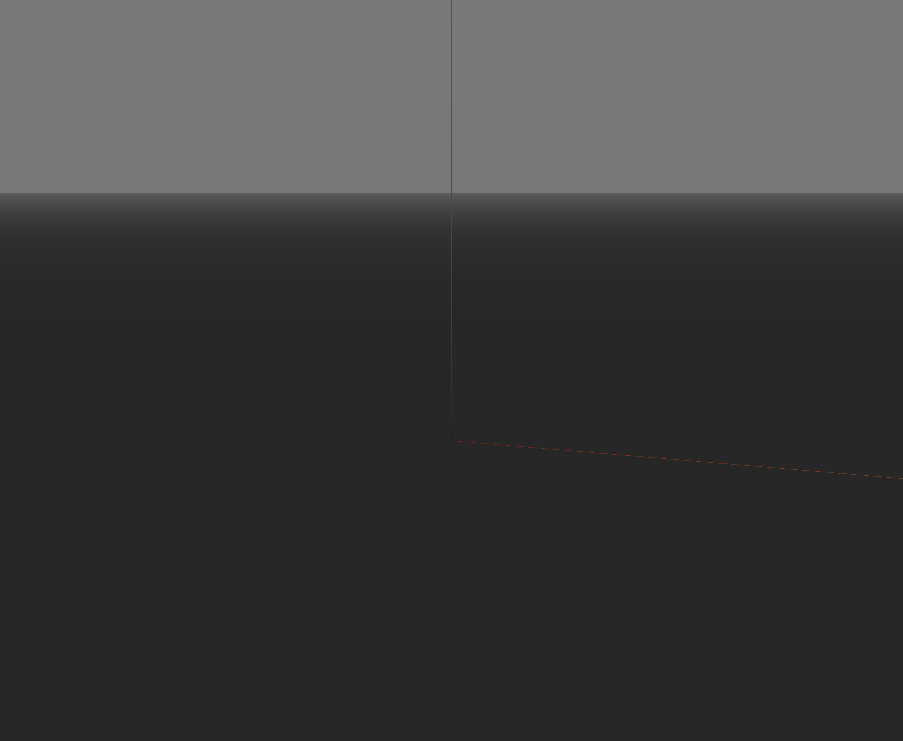
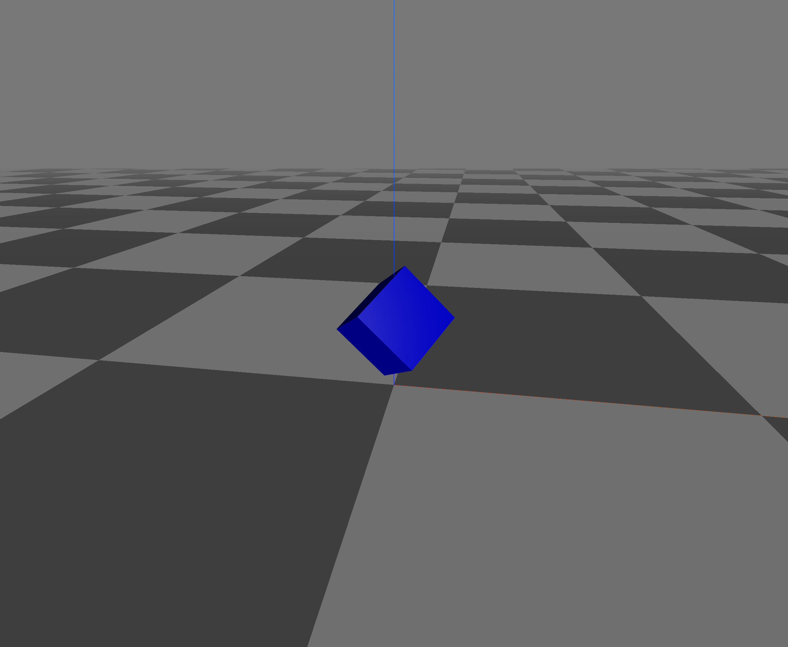
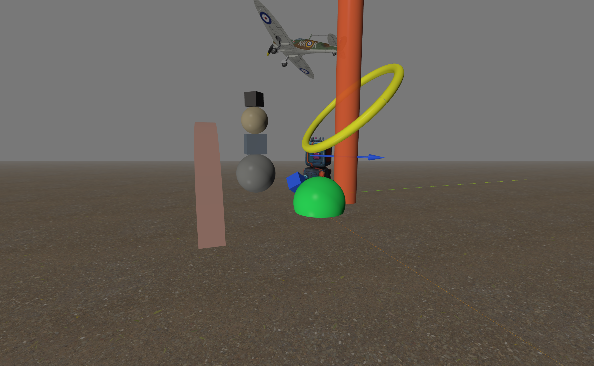
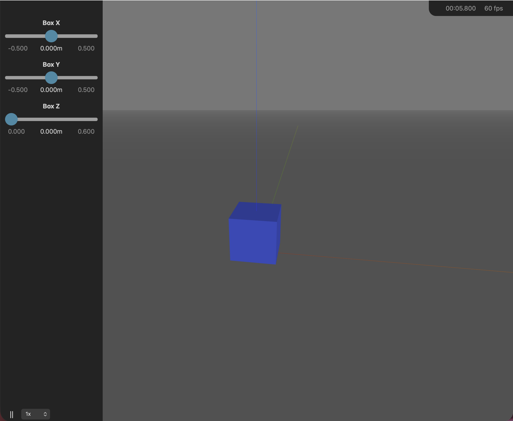

************
Introduction
************

.. TODO: expand this page with more detail.

Swift is a light-weight browser-based animation visualiser which provides
robotics-specific functionality for rapid prototyping of algorithms,
research, and education. Built using Python and Javascript, Swift is
cross-platform (Linux, macOS, and Windows).

Swift provides:

* visualisation of mesh objects (Collada, STL, OBJ, glTF/GLB, PLY, VRML/WRL,
  and PCD files) and primitive shapes;
* robot visualisation and simulation;
* interactive UI controls (sliders, buttons, and more) for driving a scene
  from the browser;
* recording and saving a video of the simulation;
* source code which can be read for learning and teaching.

Swift is the primary visualisation engine for the
`Robotics Toolbox for Python
<https://github.com/petercorke/robotics-toolbox-python>`_.
Through the Robotics Toolbox, Swift can visualise over 150 robot
models -- contemporary robots from Franka-Emika, Kinova, Universal Robotics,
Rethink, as well as classical robots such as the Puma 560 and the Stanford
arm.

Installation
============

::

    pip install swift-sim

Swift is normally installed as a dependency of `roboticstoolbox-python
<https://github.com/petercorke/robotics-toolbox-python>`_ rather than used
standalone::

    pip install roboticstoolbox-python

Swift requires Python 3.10 or later.

Quick start
===========

Displaying a shape
------------------

Let's start with a simple example that creates a blue cube in a Swift
environment. The following code snippet can be run in a Python interpreter and
it's included as :example:`box1.py`

.. code-block:: python
      :linenos:

      import spatialgeometry as sg
      from swift import Swift

      env = Swift()
      env.launch(ground_opacity=0.5)

      box = sg.Cuboid([0.2, 0.2, 0.2], color="blue")
      env.add_shape(box)

      env.hold()  # keep the browser tab open

Line 4 creates a Swift environment into which objects can be placed.
Line 5 launches the visualisation of the environment, and it opens a browser tab to show it.
Line 7 adds a blue box (cube) in the scene. The cube's reference point
is its centre, and by default it is positioned at the
origin of the world frame.
Color can be specified as a string (e.g. "blue") or as an RGB or RGBA list of floats in the range 0-1.

The graphical objects are defined by the ``spatialgeometry`` module, and the box is a cuboid (a rectangular prism) that is 0.2m in each dimension.
The ground plane is rendered with 50% opacity (line 5) so that the box appears to be half underwater -- you can
even look under the ground plane to see the box from below.
Line 8 adds the box to the scene, and line 10 blocks the script from exiting, so that the browser tab remains open.

You can navigate around the scene using your mouse, see :ref:`viewpoint-control` for details.

You can close the browser tab and the script will exit automatically.  
You can also press ``^C`` in the terminal to exit the script and this will close the browser tab.

Let's try something a little more interesting, this is :example:`box2.py`

.. code-block:: python
      :linenos:

      import spatialgeometry as sg
      from spatialmath import SE3
      from swift import Swift

      env = Swift()
      env.launch(ground_pattern="@tile")

      box = sg.Cuboid([0.2, 0.2, 0.2], pose=SE3(0, 0, 0.2)*SE3.RPY(45, 45, 0, unit="deg"), color="blue")
      env.add_shape(box)

      env.hold()  # keep the browser tab open

This time we have set the ground plane to be opaque (default) and to have a tiled
pattern.  The ground pattern can be selected as a grid (`"@grid"`) or it can be the path
to a texture image. The pose of the cube has been explicitly set, rotated the box 45
degrees about the x-axis and 45 degrees about the y-axis, and then raised above
the ground plane.

A much more complex example is :example:`busy_scene.py` which shows a scene with many
objects including a number of new shapes such as cylinders, spheres, meshes, and a path.  The big disk
has a low opacity and you change your view point to look through it. It also
has a gravel textured ground plane.

Under the hood, Swift's ``env.add()`` calls the shape's ``to_dict()`` method and sends it over
a websocket to the browser which runs Swift's JavaScript code to render the scene.

Next, we will look at how to animate shapes in Swift.

Animating shapes
----------------

To animate a shape, we simply change its pose and call :meth:`~swift.Swift.Swift.step` to update the
scene. The following example, :example:`box_orbit1.py`, animates a box moving in an orbit around the origin:

.. code-block:: python
    :linenos:

    import spatialgeometry as sg
    import spatialmath as sm
    import numpy as np
    from spatialmath import SE3
    from swift import Swift

    env = Swift()
    env.launch(realtime=True, ground_opacity=0.5)

    W = 0.1 # size of the box
    box = sg.Cuboid([W, W, W], color=[0.2, 0.4, 1.0, 1.0])
    env.add_shape(box)

    # animate
    dt = 0.02   # time step, 50 fps
    for t in np.arange(0, 20, dt):  # run for 5 seconds
        print(f"t = {t:.2f}")
        box.T = sm.SE3.Rx(t / 10) * sm.SE3.Rz(t) * sm.SE3.Tx(3 * W)
        env.step(dt)
    env.hold()  # keep the browser tab open

The ``realtime`` argument to :meth:`~swift.Swift.Swift.launch` (line 8) means that the simulation will run in real (clock) time, and the time step is set to 0.02 seconds (50 fps).
The box's pose is updated
at line 18 by setting its ``T`` attribute to a new pose -- this can be an ``SE3`` object
or a :math:`4 \times 4` homogeneous transformation matrix. In this case pose is computed as a function
of time, and the box moves in a circular orbit on a plane that tilts about the x-axis
slowly over time. The scene is updated at line 19 by calling :meth:`~swift.Swift.Swift.step` which
waits for ``dt`` seconds before continuing to the next iteration of the loop.

If there were multiple animated shapes in the scene, we would update all their poses first, and
call :meth:`step` once at the end of the loop to update the scene.

The clock is shown at top right of the Swift window, and the speed of the animation is controlled
by the ``realtime`` parameter passed to ``launch`` and keyboard commands, described in :ref:`playback-controls`.

An alternative, and more concise, way to achieve this is using callbacks.  
The following example, :example:`box_orbit2.py`, shows how to use a callback function to compute the pose of the box as a function of time:

.. code-block:: python
    :linenos:

    import spatialgeometry as sg
    import spatialmath as sm
    from spatialmath import SE3
    from swift import Swift

    env = Swift()
    env.launch(realtime=True, ground_opacity=0.5)

    W = 0.1 # size of the box
    box = sg.Cuboid([W, W, W], color="blue")

    def orbit(t, values):
        return sm.SE3.Rx(t / 10) * sm.SE3.Rz(t) * sm.SE3.Tx(3 * W)

    env.add_shape(box, callback=orbit)

    # animate
    env.run(20, dt=0.02)  # run for 5 seconds, 50 fps

In line 15, when we add the shape to the Swift environment we specify
a callback function (lines 12-13) that computes the pose of the box as
a function of time.  Line 18 runs a simulation
loop for 20 seconds with a time step of 0.02 seconds (50 fps), calls any registered
callback functions, and updates object poses.

Swift also provides a simple way to add interactive sliders to the scene, and the following example, :example:`box_sliders.py`, shows how to use sliders to control the position of a box in 3D space:

.. code-block:: python
    :linenos:

    import spatialgeometry as sg
    from spatialmath import SE3
    from swift import Swift, Slider

    env = Swift()
    env.launch(realtime=True, ground_opacity=0.5)

    W = 0.2
    box = sg.Cuboid([W, W, W], color=[0.2, 0.4, 1.0, 1.0])

    def box_pose(t, values):
        # z is height above the floor, not the box centre
        return SE3(values["x"], values["y"], values["z"] + W / 2)

    env.add_shape(box, callback=box_pose)

    env.add_ui(Slider(min=-0.5, max=0.5, step=0.01, value=0.0, label="Box X", unit="m"), name="x")
    env.add_ui(Slider(min=-0.5, max=0.5, step=0.01, value=0.0, label="Box Y", unit="m"), name="y")
    env.add_ui(Slider(min=0.0, max=0.6, step=0.01, value=0.0, label="Box Z", unit="m"), name="z")

    # animate
    env.run(dt=0.02)  # run forever at 50 fps

Lines 17-19 add slider elements to the Swift environment. Each slider has a minimum and
maximum value, a step size, an initial value, a label, and a unit.  The sliders
are named "x", "y", and "z" and their values are passed to all callback functions as the second
argument -- it is a dictionary keyed on this name.
In this example, the callback function (lines 11-13) computes the pose of the box based on the slider
values.

The slider for the z-axis controls
the height of the box above the ground plane, so we add half the box height to the
slider value to compute the box's pose.

UI elements appear in a panel on the left, not in
the 3D scene where shapes are rendered.
Slider elements can also have explicit user defined callback functions that are called when the slider value changes, and these can be used to control the pose of a shape or any other parameter in the scene.

Collision checking
------------------

The Spatial Geometry package provides a simple way to check for collisions between shapes.  The following example, :example:`collision.py`, shows 
this working for a blue box at the origin and a green sphere controlled by a slider.  
The distance between the two shapes is displayed in a label, and when the sphere gets too close to the box, both shapes change color to red.

.. code-block:: python
    :linenos:

    import spatialgeometry as sg
    from spatialmath import SE3
    from swift import Swift
    from swift.Elements import Slider, Label

    env = Swift()
    env.launch(realtime=True, ground_opacity=0.1)

    box = sg.Cuboid([0.2, 0.2, 0.2], pose=SE3(0, 0, 0), color="blue") # blue box at origin
    env.add_shape(box)

    def sphere_pose(t, values):
        return SE3(values["x"], 0, 0)

    sphere = sg.Sphere(0.1, pose=SE3(0.5, 0, 0.1), color="green") # green sphere
    env.add_shape(sphere, callback=sphere_pose)

    env.add_ui(Slider(lambda v: None, min=-2, max=2, step=0.01, value=0.5, label="Sphere X", unit="m"), name="x")
    env.add_ui((distance := Label("")), name="label")

    while True:
        env.step(0.05)
        d, p1, p2 = box.closest_point(sphere)
        distance.label = f"Distance: {d:.3f}"
        if d < 0.1:
            box.color = "red"  # change box color to red
            sphere.color = "red"  # change sphere color to red
        else:
            box.color = "blue"  # change box color back to blue
            sphere.color = "green"  # change sphere color back to green

This example draws on concepts that are familiar from the previous examples.  The blue
box is created at the origin, and a green sphere is created at x=0.5.  The sphere's pose
is controlled by a slider, and the callback function (lines 12-13) computes the pose of
the sphere based on the slider value.  

The distance between the two shapes is computed in line 23
using the ``closest_point()`` method of the box, which returns the distance and the
closest points on each shape.  The distance is displayed in a label, and when the
distance is less than 0.1, both shapes change color to red.
Note that this line could just as easily have been

.. code-block:: python
    :linenos:
    :lineno-start: 23

    d, p1, p2 = box.closest_point(sphere)

Assemblies
----------

In robotics we often have a number of rigid bodies connected together by joints, and we
can represent this as an assembly.  The following example, :example:`two_link_arm.py`,
shows a simple two link arm with two revolute joints.  The joint angles are controlled
by sliders. 

.. code-block:: python
    :linenos:

    import numpy as np
    import spatialgeometry as sg
    from spatialmath import SE3
    from swift import Swift, Slider

    env = Swift()
    env.launch(realtime=True)

    class TwoLinkArm:
        """A pure kinematic model: two links, two revolute joints about z."""

        def __init__(self, L1=0.3, L2=0.25, thickness=0.03):
            self.L1 = L1
            self.L2 = L2
            self.link1 = sg.Cuboid([L1, thickness, thickness], color="red")
            self.link2 = sg.Cuboid([L2, thickness, thickness], color="blue")

        def part_poses(self, q) -> list[SE3]:
            # World pose of each link, purely as a function of q. Each cuboid's local origin
            # sits at its own proximal (joint) end, so Tx(length / 2) places its centre correctly
            frame1 = SE3.Rz(q[0])
            frame2 = frame1 * SE3.Tx(self.L1) * SE3.Rz(q[1])
            return [frame1 * SE3.Tx(self.L1 / 2), frame2 * SE3.Tx(self.L2 / 2)]

    arm = TwoLinkArm()

    handle = env.add_assembly(
        arm.part_poses,
        [arm.link1, arm.link2],
        q0=[0.0, 0.0],
        callback=lambda t, values: [values["q1"], values["q2"]],
    )

    env.add_ui(Slider(min=-np.pi, max=np.pi, step=0.01, value=0.0, label="Joint 1", unit="rad"), name="q1")
    env.add_ui(Slider(min=-np.pi, max=np.pi, step=0.01, value=0.0, label="Joint 2", unit="rad"), name="q2")

    env.show()

    env.run(dt=0.02) # run forever at 50 fps

Again, there are many familiar concepts in this example. Lines 9-23 define a class which constructs a simple two-link robot. The links
are rectangular prisms, the first link is red, the second is blue.
The ``part_poses()`` method is the forward kinematics and computes the world pose of each link frame as a function of the joint angle array ``q``.  The
link frames are at the proximal end of each link, so in line 23 the frames are translated by half the length to account for the shape's origin being
in the centre not at one end.  The method maps the configuration ``q`` to the world of each constituent shape.

The ``add_assembly()`` method is new.  Its parameters are the method to compute shape poses from configuration, the list of shapes, the initial configuration,
and a UI callback function.  The callback extracts the relevant configuration values from the ``values`` dictionary and returns a configuration array.
It adds the assembly to the Swift environment, and registers its own callback.

The :meth:`~swift.Swift.Swift.run` method drives the animation loop. For the assembly, at each time step:

* the callback at line 31 is called to obtain the configuration array
* ``arm.part_poses()`` is invoked with the configuration array, which returns a list of the world pose of each constituent shape
* those poses are then sent to the browser to update the scene.

We also introduce a new method ``env.show()`` which displays what's in the scene, and in this case displays::

  Swift backend, t = 0.0, scene:
  [0] AssemblyHandle
  UI[2] Slider "q1"
  UI[3] Slider "q2"

Scene graphs
------------

The concept of a scene graph is fundamental to 3D graphics.  A scene graph is a tree of
nodes, where each node has a pose relative to its parent node.  The root node is the
world frame, and all other nodes are defined relative to their parent.  The world pose
of a node is computed by multiplying the poses along the path from the root to the node.
Scene graphs are a ``spatialgeometry`` concept, not a Swift one -- see spatialgeometry's own
`Scene graphs <https://jhavl.github.io/spatialgeometry/intro.html#scene-graphs>`_
section for a fuller treatment.

.. code-block:: python
    :linenos:

    import numpy as np
    import spatialgeometry as sg
    from spatialmath import SE3
    from swift import Swift, Slider

    env = Swift()
    env.launch(realtime=True)

    L1, L2, thickness = 0.3, 0.25, 0.03
    link1 = sg.Cuboid([L1, thickness, thickness], color="red")
    link2 = sg.Cuboid([L2, thickness, thickness], color="blue")

    link2.scene_parent = link1

    env.add_shape(link1, callback=lambda t, values: SE3.Rz(values["q1"]) * SE3.Tx(L1/2))
    env.add_shape(link2, callback=lambda t, values: SE3.Tx(L1/2) * SE3.Rz(values["q2"]) * SE3.Tx(L2/2))

    env.add_ui(Slider(min=-np.pi, max=np.pi, step=0.01, value=0.0, label="Joint 1", unit="rad"), name="q1")
    env.add_ui(Slider(min=-np.pi, max=np.pi, step=0.01, value=0.0, label="Joint 2", unit="rad"), name="q2")

    print(link1.tree())
    env.show()

    env.run(dt=0.05)

Lines 10-11 define the two colored rectangular prisms which represent the links of the robot.
Line 13 declares that the second link is a child of the first link, so its pose is defined relative to the first link's frame.

Lines 15-16 add the two links to the Swift environment, and specify a callback function for each link which computes its world pose as a function of the joint angles.  
The first link's pose is computed as:

* a rotation about the z-axis by the first joint angle, then
* a translation along the x-axis by half its length, which is where the centre of its cuboid is located.
   
The second link's pose is relative to the first link and is computed as:

* a translation along the x-axis by the remaining half-length of the first link, so the frame is now at the distal end of that link, then
* a rotation about the z-axis by the second joint angle, and then
* a translation along the x-axis by half its length, which is where the centre of its cuboid is located.

Line 21 displays the scene graph that contains ``link1``, from its root.
The alternative ``tree_children()`` shows only the part of the scene graph
containing this node and its children.
The output of ``link1.tree()`` is::

  Cuboid(scale=[0.3, 0.03, 0.03], color=(1.0, 0.0, 0.0), pose='t = 0, 0, 0; rpy/zyx = 0°, 0°, 0°')  <==
      Cuboid(scale=[0.25, 0.03, 0.03], color=(0.0, 0.0, 1.0), pose='t = 0, 0, 0; rpy/zyx = 0°, 0°, 0°')

Indentation is used to show the hierarchical structure of the scene graph, the blue link is the child of the red link, and the current link (``self``) indicated by ``<==``.

The Swift environment is displayed at line 22, and the output shows the two links and the two sliders::

  Swift backend, t = 0.0, scene:
    [0] Cuboid(scale=[0.3, 0.03, 0.03], color=(1.0, 0.0, 0.0), pose='t = 0, 0, 0; rpy/zyx = 0°, 0°, 0°')
    [1] Cuboid(scale=[0.25, 0.03, 0.03], color=(0.0, 0.0, 1.0), pose='t = 0, 0, 0; rpy/zyx = 0°, 0°, 0°')
    UI[2] Slider "q1"
    UI[3] Slider "q2"

